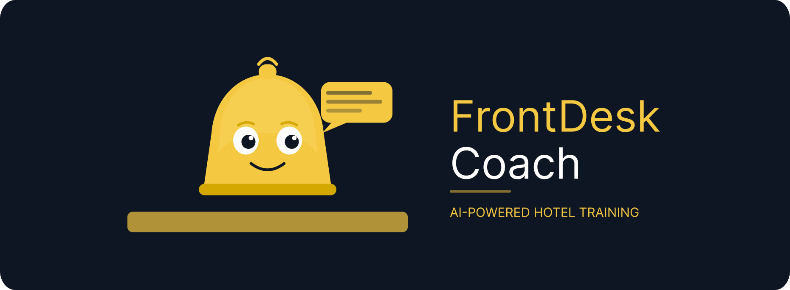
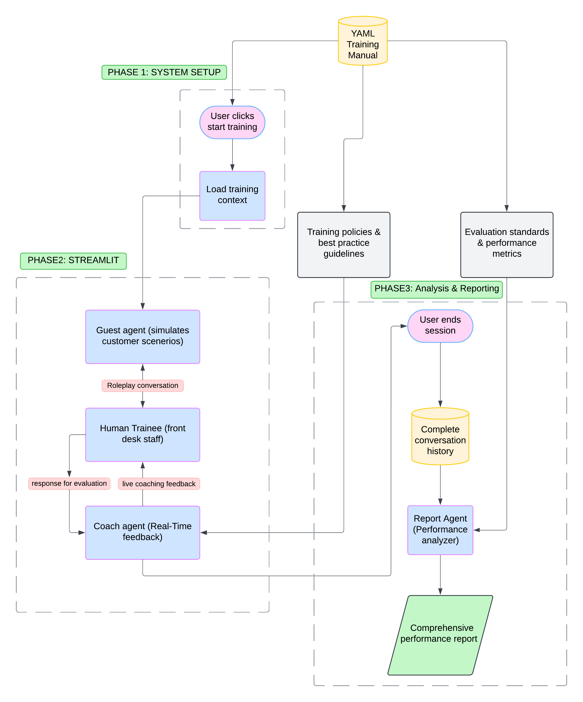

<p align="center">
  
</p>

<p align="center">
  AI-powered training for hotel front desk staff — real scenarios, real-time coaching, real results.
</p>

---

FrontDesk Coach puts trainees through realistic guest interactions with an AI guest agent, while a coach agent watches every response and gives live feedback grounded in your hotel's actual training manual. When the session ends, a report agent produces a full performance breakdown.

## How It Works



**Three agents. One session.**

- **Guest Agent** — simulates real guest scenarios (billing disputes, room complaints, special requests)
- **Coach Agent** — watches every response and gives live feedback based on your YAML training manual
- **Report Agent** — generates a full performance report when the session ends

## Quick Start

```bash
git clone https://github.com/sanjeev-rm/Frontdesk-Coach.git
cd Frontdesk-Coach
pip install -r requirements.txt
cp .env.template .env   # add your API key
streamlit run app.py
```

Open `http://localhost:8501`, click **Start Training Session**, and begin.

> Full setup guide → [docs/SETUP.md](docs/SETUP.md)

## Docs

| | |
|---|---|
| [Setup & Configuration](docs/SETUP.md) | Installation, environment variables, model config |
| [Architecture](docs/ARCHITECTURE.md) | Agent design, data flow, system phases |
| [Troubleshooting](docs/TROUBLESHOOTING.md) | Common issues and fixes |

---

Built for INFO 5940 · Cornell University · Fall 2025
